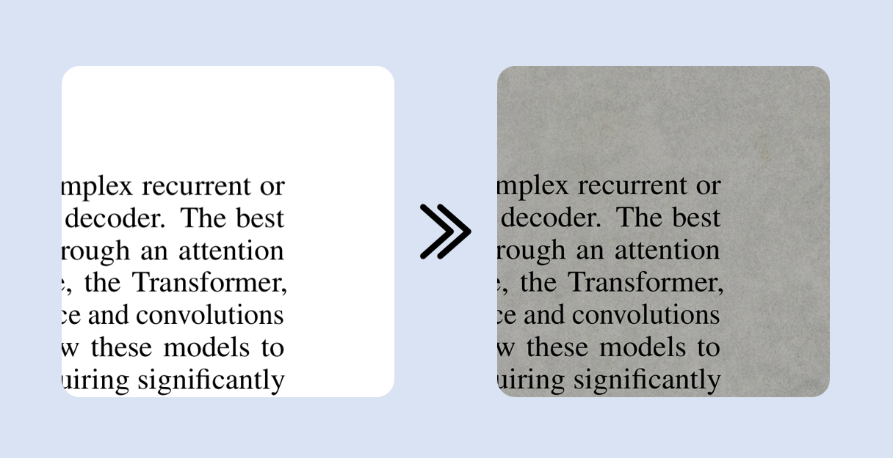

# PDF Dark Filter



**PDF Dark Filter** is a browser extension designed for Microsoft Edge that enhances the PDF reading experience. More than just a simple color inversion, it utilizes physical byte manipulation and intelligent CSS blending to inject soft dark backgrounds and realistic paper textures into PDF documents, significantly reducing eye strain during long reading sessions.

---

## ✨ Key Features

- **Dual-Mode Architecture**:
  - **Standard Mode (Physical Modification)**: Uses `pdf-lib` to inject a color layer directly into the PDF data stream, allowing you to "Save As" a filtered version of the document.
  - **Compatibility Mode (CSS Overlay)**: Employs non-destructive CSS `mix-blend-mode` overlays. It preserves the original file integrity, ideal for documents requiring digital signatures or complex annotations.
- **Realistic Textures**: Built-in high-quality paper textures combined with `mix-blend-mode: multiply` provide a tactile, book-like feel to digital documents.
- **Immersive Loading**: A smooth 3D wave loading animation powered by `Vanta.js` and `Three.js`, featuring a stylized Anton 3D stacked typography effect.
- **Privacy First**: All processing is done locally in your browser. No data is collected, stored, or uploaded.

---

## 🛠️ Tech Stack

This project relies on the following excellent open-source libraries:

- [pdf-lib](https://pdf-lib.js.org/) - High-performance PDF manipulation in the browser.
- [Vanta.js](https://www.vantajs.com/) & [Three.js](https://threejs.org/) - Fluid 3D background rendering.
- [Google Fonts (Anton)](https://fonts.google.com/specimen/Anton) - Visual branding for the loading interface.

---

## 🚀 Quick Start

### Installation for Developers

1.  Clone this repository:
    ```bash
    git clone https://github.com/LionelGuo/PDF-Dark-Filter.git
    ```
2.  Open Microsoft Edge and navigate to `edge://extensions/`.
3.  Enable **"Developer mode"** in the bottom left corner.
4.  Click **"Load unpacked"** and select the project root directory.
5.  Open any PDF file and enjoy the view!

---

## 📖 Modes Comparison

| Feature | Standard Mode (Default) | Compatibility Mode |
| :--- | :--- | :--- |
| **Logic** | Modifies PDF byte stream via `pdf-lib` | CSS `mix-blend-mode` overlay |
| **Saving** | Saved file includes the filter color | Saved file remains original |
| **Best For** | Archival reading, sharing filtered PDFs | Temporary reading, PDF annotations |
| **Interactivity** | Full PDF interactivity preserved | Full PDF interactivity preserved |

---

## 🛡️ Privacy & Security

- **No Data Collection**: PDF Dark Filter does NOT collect, store, or upload your browsing history, personal information, or PDF content.
- **Local Processing**: All PDF modification logic is executed locally on your machine.
- **Permissions**:
  - `storage`: To save your filter preferences.
  - `scripting` & `activeTab`: To inject the filter into the current PDF page.

---

## ⚖️ License

This project is licensed under the [MIT License](LICENSE). You are free to use, modify, and distribute it.

---

## 🙌 Contribution & Feedback

If you find a bug or have a feature request, please feel free to open an [Issue](https://github.com/LionelGuo/PDF-Dark-Filter/issues) or submit a Pull Request.
